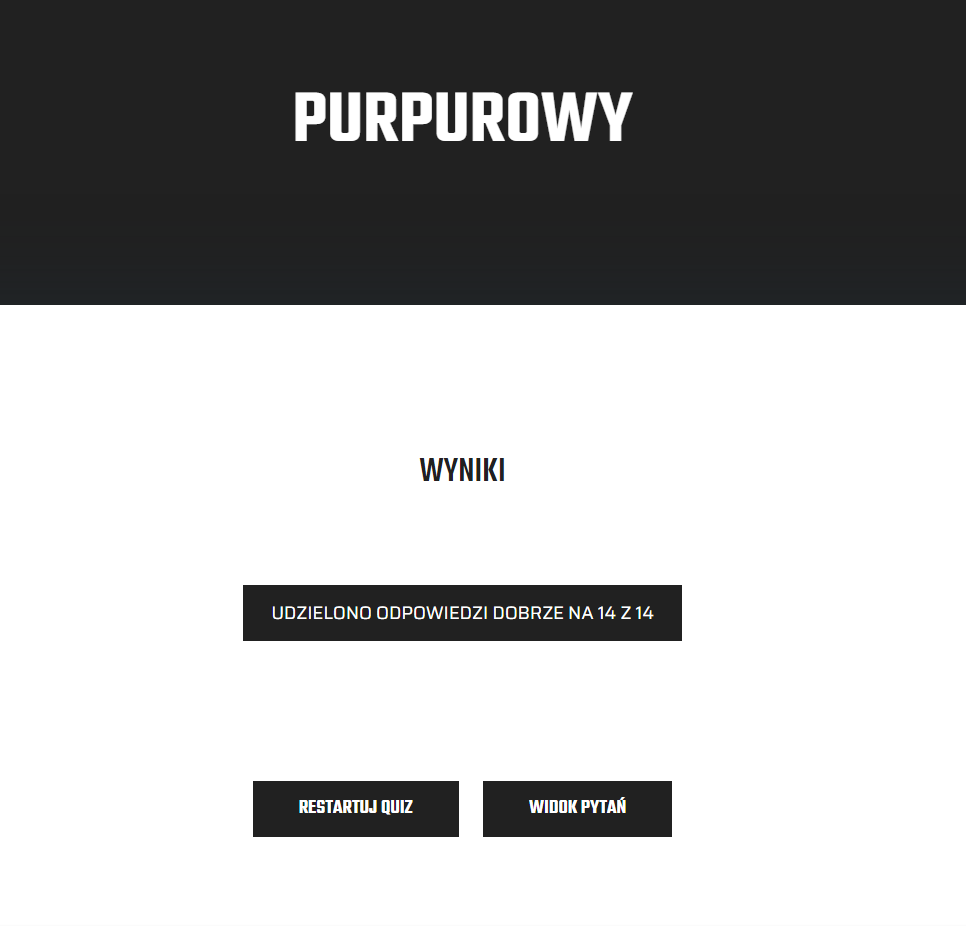

# Zadanie 1: Konfiguracja oprogramowania

## Podzadanie 1: "Dlaczego zdecydowałam się wziąć udział w wyzwaniu Dare IT Challenge?"

1. Mam na imię Paulina i jestem kulturoznawczynią zakochaną w Pythonie...Dysonans? Bynajmniej 😃.
Cenię sobie w życiu równowagę, chciałam więc sprawdzić jak poradzę sobie w czymś "z zupełnie innej beczki". 

2. Na 8-miesięcznym kursie Cyber Trainees organizowanym przez Instytut Kościuszki i Fundację Microsoft poznałam Pythona i...przepadłam 🤓. 

3. Nauczyłam się solidnych podstaw pisania w tym języku, ukończyłam również klasę testerską, tak więc wyzwanie **Dare IT - Wstęp do testów automatycznych** - które łączy testowanie z Pythonem - wydało mi się wyborem całkowicie naturalnym.

4. Chcę poznać lepiej Github, stworzyć własne portfolio i wykorzystać dotychczasową wiedzę w praktyce.

## Podzadanie 4:

Wynik testu PURPUROWEGO http://getistqb.com/quiz-purpurowy/:

# Zadanie 2: selektory

To zadanie nauczyło mnie:

✅ czym są selektory,

✅ gdzie szukać selektorów,

✅ zapisu xPath’ów,

✅ czym się kierować, aby wyodrębnić te “najlepsze” selektory

### Selektory do strony logowania 
**https://scouts-test.futbolkolektyw.pl/**

1. **scouts_panel_header_xpath** 

   - //h5
   
   - //*[text()="Scouts Panel"]

   - //h5[@class="MuiTypography-root MuiTypography-h5 MuiTypography-gutterBottom"]

2. **login_field_xpath**

   - //*[@id="login"]
   
   - //input[@name="login"]
   
   - //*[@id="__next"]/form/div/div/div/div/input

3. **password_field_xpath**

   - //*[@id="password"]
   
   - //input[@name="password"]
   
   - //form/div/div/div[2]/div/input

4. **remind_password_hyperlink_xpath**

   - //*[@id="__next"]/form/div/div[1]/a
   
   - //*[text()="Remind password"]
   
   - //child::div/a

5. **language_button_xpath** 

   - //*[@id="__next"]/form/div/div[2]/div/div
   
   - //*[text()="English"]

   - //*[contains(@class, "MuiSelect-root MuiSelect-select")] 

6. **sign_in_button_xpath**

   - //*[@id="__next"]/form/div/div[2]/button/span[1]
   
   - //*[text()="Sign in"]
   
   - //*[contains(@class, "MuiButton-l")] 

# Zadanie 3: Pierwszy test automatyczny i asserty

To zadanie pozwoliło mi m.in.:

✅ poznać framework Selenium,

✅ klikać w elementy na stronie,

✅ wypełniać pola tekstem,

✅ wykorzystywać assert title, 

✅ uruchomić test

🚨 **Zajrzyj do plików z kodem, by ocenić moją pracę!** 😊
https://github.com/PaulinaDziadura/Challenge_portfolio_paudzi.git

# Zadanie 4: Refactor, debugger i przypadki testowe

W tym zadaniu m.in.:

✅ wykonaliśmy refactor naszego kodu,

✅ dowiedzieliśmy się jak pracować z debuggerem,

✅ zaprojektowaliśmy i napisaliśmy własne test case’y,

✅ zautomatyzowaliśmy stronę internetową na podstawie TC.

🚨 **Poniżej link do folderu, w którym znajdziesz moje Test Case'y:**

https://drive.google.com/drive/folders/1_ImIsMVBsofccNHl1ZmAkKrP1K7fJCOz?usp=share_link

# Zadanie 5: Robot framework

To zadanie pozwoliło mi m.in.:

✅ dowiedzieć się czym jest Smoke Tests

✅ dowiedzieć się jak skonfigurować Suite Test

✅ poznać nowy framework,

✅ wygenerować automatycznie raport

🚨 **Poniżej link do mojego repo z robotem**😊

👉 https://github.com/PaulinaDziadura/dareit_challenge_portfolio_robotframework.git